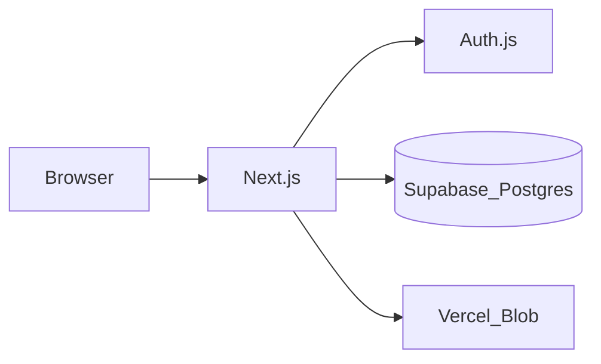

# dev_todo

Personal dev project checklists: **projects → lists → sections & checkbox items**, optional **links** and **screenshot attachments**, with **Google**, **GitHub**, and **email/password** sign-in (no email verification).

## Docs

- [Implementation plan](docs/dev-todo-plan.md)
- [Design & LLD](docs/design-lld.md)
- [Default template content](docs/software-dev-template.md)

## Stack

Next.js App Router, Auth.js, Prisma, **Supabase Postgres**, Vercel Blob, Tailwind + shadcn-style UI.

## Browser extensions (MetaMask)

This app does **not** use Web3 or MetaMask. If you still see `Failed to connect to MetaMask`, that is the **MetaMask browser extension** (or a broken partial install) injecting into every tab—not this codebase.

1. **Best fix:** In Chrome → Extensions → MetaMask → **Remove** or turn **Off**, or disable “Allow on localhost”.
2. The app loads `/block-wallet-extensions.js` to swallow extension errors and no-op `ethereum.connect` on this site only.

If errors persist after disabling the extension, restart the browser (stale `inpage.js` can remain until restart).

## Local setup

1. Copy `.env.example` to `.env.local` and fill values.
2. Create a [Supabase](https://supabase.com) project → **Settings → Database** → copy the **URI** (use the pooler URL for serverless if deploying to Vercel).
3. Run migrations:

```bash
npm install
npx prisma migrate dev
```

4. Start the app:

```bash
npm run dev
```

Open [http://localhost:43123](http://localhost:43123).

## Environment variables

| Variable | Required | Description |
|----------|----------|-------------|
| `DATABASE_URL` | Yes | Supabase Postgres connection string |
| `AUTH_SECRET` | Yes | `openssl rand -base64 32` |
| `AUTH_URL` | Prod | Canonical site URL |
| `GOOGLE_CLIENT_ID` / `GOOGLE_CLIENT_SECRET` | OAuth | Google sign-in |
| `GITHUB_CLIENT_ID` / `GITHUB_CLIENT_SECRET` | OAuth | GitHub sign-in |
| `BLOB_READ_WRITE_TOKEN` | Uploads | Vercel Blob token |
| `MAX_ATTACHMENT_BYTES` | No | Default 5MB |
| `MAX_ATTACHMENTS_PER_LIST` | No | Default 50 |

## Scripts

| Command | Description |
|---------|-------------|
| `npm run dev` | Dev server |
| `npm run build` | `prisma generate` + production build |
| `npm run lint` | ESLint |
| `npm run typecheck` | `tsc --noEmit` |
| `npm run test` | Vitest |

## Deploy (Vercel)

1. Import repo, set env vars (same as above).
2. Build runs `prisma generate` via `postinstall`; run **`prisma migrate deploy`** in the build command or as a release step, e.g.  
   `npx prisma migrate deploy && npm run build`
3. Register OAuth redirect URLs for production and preview hosts.
4. Create a Vercel Blob store and set `BLOB_READ_WRITE_TOKEN`.

## Architecture



All mutations use server actions or route handlers with ownership checks in `lib/permissions.ts`.
