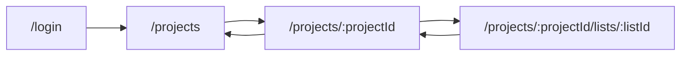
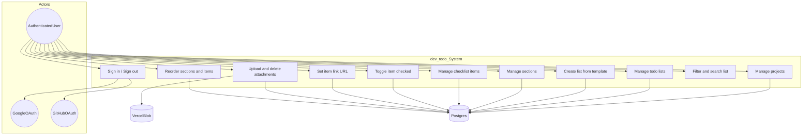
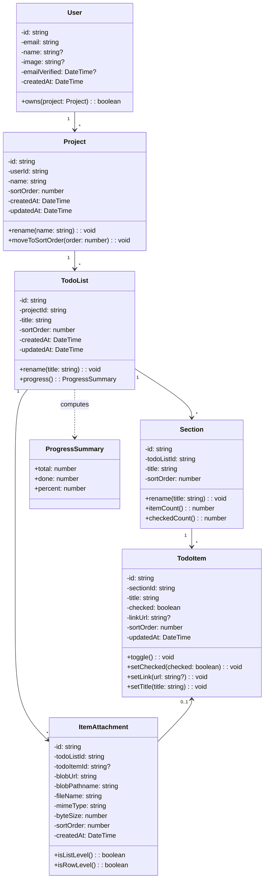
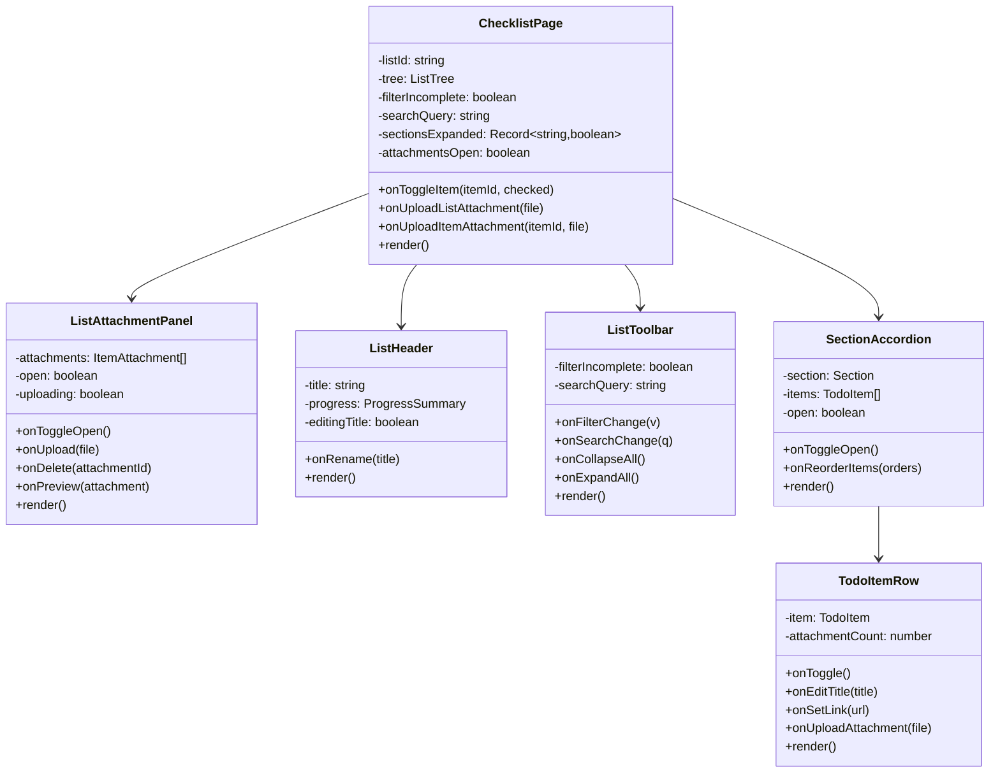
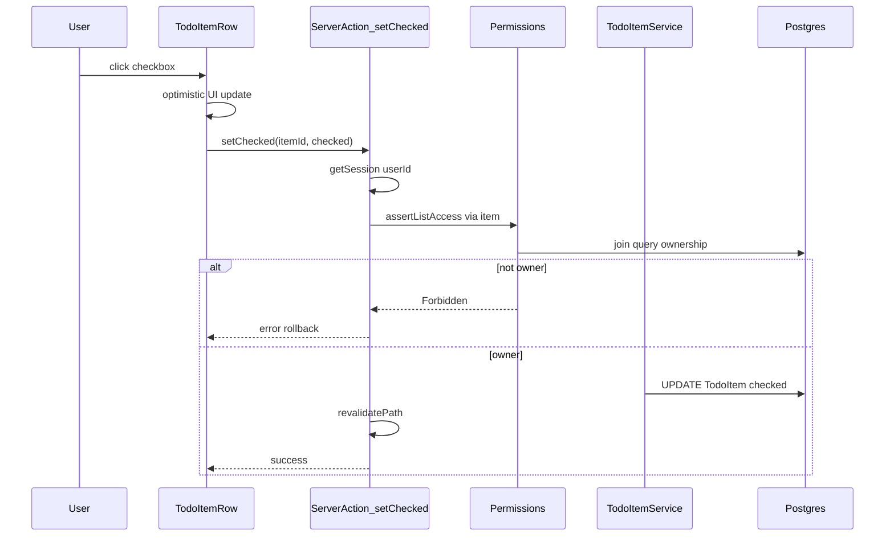

# dev_todo — Design & LLD

Companion to the [Implementation plan](docs/dev-todo-plan.md). Describes UI layout, use cases, domain/application/UI classes (state + operations), DTOs, and a reference sequence.

---

## Screen map



---

## Main layout (checklist view)

**Render order in main column:** `ListHeader` → **`ListAttachmentPanel`** → `ListToolbar` → `SectionAccordion[]`.

List attachments sit **at the top** of the main panel (below list title/progress), **before** toolbar and sections.

```
┌──────────────────────────────────────────────────────────────────────────┐
│  dev_todo          [theme]                              [user] [logout]  │
├──────────────┬───────────────────────────────────────────────────────────┤
│  PROJECTS    │  My SaaS v2                    Progress  42 / 180  ███░░  │
│  + Project   ├───────────────────────────────────────────────────────────┤
│              │  ▼ List attachments (collapsible)  [upload]  [thumb][thumb]│
│  ▸ Project A │  ─────────────────────────────────────────────────────────│
│    · List 1  │  [Search…]  [Incomplete only]  [Collapse all] [Expand]   │
│    · List 2  ├───────────────────────────────────────────────────────────┤
│  ▸ Project B │  ▼ 1. Requirements ───────────────────────────  3/11      │
│              │     ☐ Understand the problem    🔗  📎   │  ☐ Define…   │
│  + List      │     ☑ Define MVP scope          🔗       │  ☐ Identify… │
│              │  ▼ 2. Planning … (2-col on lg) …                         │
└──────────────┴───────────────────────────────────────────────────────────┘
```

- **Left rail:** projects, nested lists, create project/list; collapsible sheet on mobile.
- **List attachments:** collapsible; upload button; thumbnail strip; list-level files (`todoItemId` null) and optional row-linked files surfaced here or on rows.
- **UX polish:** expand attachments panel by default when list has attachments; collapsed when empty (optional).

---

## Use case diagram

**Primary actor:** AuthenticatedUser. **External:** GoogleOAuth, GitHubOAuth, VercelBlob, Postgres.



### Use case catalog

| ID | Use case | Preconditions | Main flow | Postcondition |
|----|----------|---------------|-----------|---------------|
| UC-01 | Sign in | Logged out | OAuth redirect → session in DB | Session cookie set |
| UC-02 | Create project | Authenticated | Name → `ProjectService.create` | Project owned by user |
| UC-03 | Create todo list | Owns project | Title + template or blank → optional `seedListFromTemplate` | List + sections/items if template |
| UC-04 | Open checklist | Owns list | Load `ListTree` (sections, items, attachments) | UI renders per layout order |
| UC-05 | Toggle checkbox | Owns list | `TodoItemService.setChecked` | `checked` persisted |
| UC-06 | Edit item/section | Owns list | CRUD + Zod validation | DB updated |
| UC-07 | Upload screenshot | Owns list | API → Blob → `ItemAttachment` (`todoListId`, optional `todoItemId`) | File + metadata stored |
| UC-08 | Reorder | Owns list | Batch `sortOrder` in transaction | Order persisted |

---

## Domain classes (entities — state + behavior)

Persistence via Prisma. Domain methods may live on types or be enforced in services.



---

## Application layer (services — state + operations)

Planned under `lib/` (modules; may be functions rather than classes).

```mermaid
classDiagram
  class Permissions {
    -db: PrismaClient
    +getProjectForUser(userId, projectId): Promise~Project~?
    +getListForUser(userId, todoListId): Promise~TodoListWithProject~?
    +assertProjectAccess(userId, projectId): Promise~Project~
    +assertListAccess(userId, todoListId): Promise~TodoList~
    +resolveItemListId(userId, itemId): Promise~string~
  }

  class ProjectService {
    -db: PrismaClient
    -perm: Permissions
    +list(userId): Promise~Project[]~
    +create(userId, dto: CreateProjectDto): Promise~Project~
    +update(userId, projectId, dto: UpdateProjectDto): Promise~Project~
    +delete(userId, projectId): Promise~void~
    +reorder(userId, dto: ReorderDto): Promise~void~
  }

  class TodoListService {
    -db: PrismaClient
    -perm: Permissions
    -seeder: TemplateSeeder
    +listByProject(userId, projectId): Promise~TodoList[]~
    +getFullTree(userId, listId): Promise~ListTree~
    +createBlank(userId, projectId, dto): Promise~TodoList~
    +createFromTemplate(userId, projectId, title): Promise~TodoList~
    +update(userId, listId, dto): Promise~TodoList~
    +delete(userId, listId): Promise~void~
  }

  class SectionService {
    -db: PrismaClient
    -perm: Permissions
    +create(userId, listId, title): Promise~Section~
    +update(userId, sectionId, dto): Promise~Section~
    +delete(userId, sectionId): Promise~void~
    +reorder(userId, listId, orders: SortOrderInput[]): Promise~void~
  }

  class TodoItemService {
    -db: PrismaClient
    -perm: Permissions
    +create(userId, sectionId, title): Promise~TodoItem~
    +update(userId, itemId, dto): Promise~TodoItem~
    +setChecked(userId, itemId, checked: boolean): Promise~TodoItem~
    +delete(userId, itemId): Promise~void~
    +reorder(userId, sectionId, orders: SortOrderInput[]): Promise~void~
  }

  class AttachmentService {
    -db: PrismaClient
    -perm: Permissions
    -blob: BlobClient
    -maxBytes: number
    -maxPerList: number
    +listForList(userId, listId): Promise~ItemAttachment[]~
    +listForItem(userId, itemId): Promise~ItemAttachment[]~
    +upload(userId, listId, file: File, todoItemId?: string): Promise~ItemAttachment~
    +delete(userId, attachmentId): Promise~void~
    -validateFile(file): void
    -enforceQuota(listId): Promise~void~
  }

  class TemplateSeeder {
    +TEMPLATE_VERSION: string
    +getDefinition(): TemplateDefinition
    +seedListFromTemplate(tx, todoListId): Promise~void~
  }

  class ListTree {
    +list: TodoList
    +sections: SectionWithItems[]
    +attachments: ItemAttachment[]
  }

  ProjectService --> Permissions
  TodoListService --> Permissions
  TodoListService --> TemplateSeeder
  SectionService --> Permissions
  TodoItemService --> Permissions
  AttachmentService --> Permissions
  TodoListService ..> ListTree
```



---

## Presentation layer (components — state + handlers)



---

## DTOs and value types

| Type | Fields |
|------|--------|
| `CreateProjectDto` | `name: string` |
| `UpdateProjectDto` | `name?: string` |
| `CreateListDto` | `title: string`, `mode: 'template' \| 'blank'` |
| `UpdateListDto` | `title?: string` |
| `UpdateItemDto` | `title?: string`, `linkUrl?: string \| null` |
| `SortOrderInput` | `{ id: string, sortOrder: number }` |
| `ReorderDto` | `{ orders: SortOrderInput[] }` |
| `TemplateDefinition` | `{ version: string, sections: { title: string, items: string[] }[] }` |
| `ListTree` | `{ list, sections: SectionWithItems[], attachments }` |

Template content source: [Software Development template](docs/software-dev-template.md) → `lib/template/software-dev-todo.ts`.

---

## Sequence: toggle checkbox (ownership)


