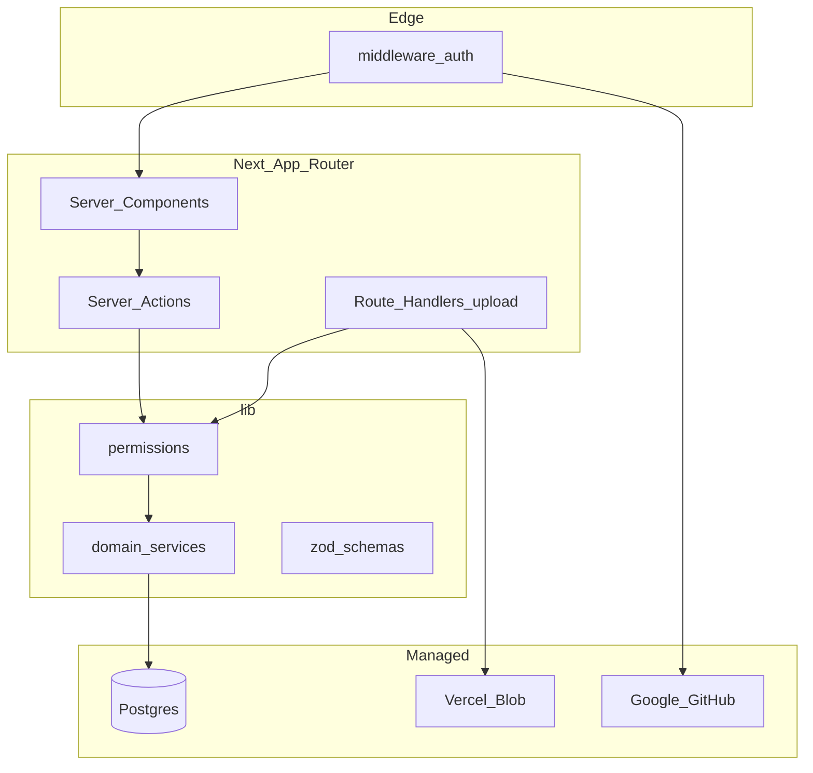
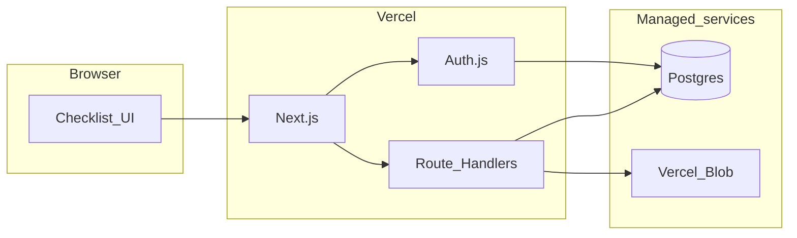

# dev_todo — Next.js project todo lists (senior implementation plan)

**Related docs:** [Design & LLD](docs/design-lld.md) (layout, use cases, class diagrams with state/operations) · [Software Development template](docs/software-dev-template.md)

## Product goals (v1)

- Authenticated **personal** workspace: **projects** → **multiple todo lists** per project.
- Each list: **sections + checkbox items**, default **Software Development template**, with **add/edit/delete/reorder**.
- Per item: **checked**, optional **link**; screenshots via **`ItemAttachment` on `TodoList`** (optional link to item).
- **Viewport-first** modern UI: sidebar + dense checklist, minimal scroll.
- **Deploy on Vercel** with **PostgreSQL** and **OAuth** (Google + GitHub).

## Architecture principles

1. **Single writer path** — All DB mutations go through server actions or Route Handlers; no client-side Prisma.
2. **Defense in depth** — Session in middleware + **re-check ownership** in every mutation (never trust IDs from the client).
3. **Thin routes, fat domain** — Reusable modules under `lib/` (permissions, templates, attachments); actions call services.
4. **Transactional consistency** — Template seed, reorder batches, and upload metadata use DB transactions.
5. **Fail closed** — Unauthorized → same response shape as not found where appropriate (avoid ID enumeration).
6. **Operable v1** — CI blocks broken builds; env documented; smoke checklist before calling prod “live”.



## Stack

| Layer | Choice | Notes |
|--------|--------|--------|
| Framework | Next.js 15 App Router, TypeScript strict | `server-only` on data modules |
| UI | Tailwind + shadcn/ui + next-themes | Keyboard/a11y on checkboxes and DnD |
| Auth | Auth.js v5 + Prisma adapter | DB sessions; secure cookies in prod |
| ORM | Prisma | Migrations in repo; no `db push` in prod |
| DB | Neon or Vercel Postgres | Connection pooling (`?pgbouncer=true` if needed) |
| Blob | Vercel Blob | Store `pathname` or URL for delete |
| Validation | Zod | Shared input schemas actions + API |
| DnD | @dnd-kit | Accessible drag handles |
| CI | GitHub Actions on `main` | lint, tsc, prisma validate, build |
| Tests (v1) | Vitest | Permissions + Zod + pure helpers; smoke optional |

## Data model (Prisma)

```mermaid
erDiagram
  User ||--o{ Project : owns
  Project ||--o{ TodoList : has
  TodoList ||--o{ Section : has
  TodoList ||--o{ ItemAttachment : has
  Section ||--o{ TodoItem : has
  User ||--o{ Account : oauth
  User ||--o{ Session : sessions

  Project {
    string id PK
    string userId FK
    string name
    int sortOrder
    datetime createdAt
    datetime updatedAt
  }
  TodoList {
    string id PK
    string projectId FK
    string title
    int sortOrder
    datetime createdAt
    datetime updatedAt
  }
  Section {
    string id PK
    string todoListId FK
    string title
    int sortOrder
  }
  TodoItem {
    string id PK
    string sectionId FK
    string title
    boolean checked
    string linkUrl nullable
    int sortOrder
    datetime updatedAt
  }
  ItemAttachment {
    string id PK
    string todoListId FK
    string todoItemId FK nullable
    string blobUrl
    string blobPathname
    string fileName
    string mimeType
    int byteSize
    int sortOrder
    datetime createdAt
  }
```

### Relationships and deletes

- **`ItemAttachment.todoListId`** required; **`todoItemId`** optional (list-level vs row-level screenshot).
- **`todoItemId`**: `onDelete: SetNull` so deleting a row does not remove list-level files.
- **Cascade**: `Project` → `TodoList` → `Section` / `ItemAttachment`; `Section` → `TodoItem`.
- **`User`**: cascade projects when user deleted (or restrict if you add billing later).

### Indexes (query paths)

| Index | Purpose |
|--------|---------|
| `Project(userId, sortOrder)` | Sidebar project list |
| `TodoList(projectId, sortOrder)` | Lists per project |
| `Section(todoListId, sortOrder)` | Load full list in one query |
| `TodoItem(sectionId, sortOrder)` | Items per section |
| `ItemAttachment(todoListId, sortOrder)` | Gallery + row thumbnails |
| `ItemAttachment(todoItemId)` partial where not null | Attachments per row |

### Authorization model

Application services, DTOs, and UI component responsibilities: [Design & LLD](docs/design-lld.md).

Central module [`lib/permissions.ts`](lib/permissions.ts):

- `getProjectForUser(userId, projectId)` → project or `null`
- `getListForUser(userId, todoListId)` → list + projectId or `null`
- `assertListAccess(userId, todoListId)` → throws `ForbiddenError` / returns entity

Every server action starts with session user id + `assertListAccess`. **Integration tests** (or Vitest with mocked Prisma) assert cross-user access fails.

## Template seeding

- **Canonical content (pre-build):** [Software Development template](docs/software-dev-template.md) — full 18 sections and checkbox labels; version `1.0.0`.
- **At implementation:** transcribe into [`lib/template/software-dev-todo.ts`](lib/template/software-dev-todo.ts) (structured TS export); keep in sync with the doc or generate from it; `TEMPLATE_VERSION` for future migrations.
- `seedListFromTemplate(tx, todoListId)` — single transaction; batch insert sections then items with stable `sortOrder`.
- Create list UI: **From template** (default) | **Blank**.
- Defer **“Reset to template”** in v1 (data-loss risk); document as Phase 2.

## Auth

- Providers: **Google**, **GitHub**.
- Env: `AUTH_SECRET`, `AUTH_URL` (prod), provider secrets, `DATABASE_URL`.
- Routes: `/login`; protect `/(app)/**` via middleware matcher.
- Callback URLs: **separate** for localhost, Vercel preview (`*.vercel.app`), and production domain.
- Post-login: `/projects` or last project via **httpOnly cookie** `last_project_id` (validated on read).

## API and mutations

| Concern | Pattern |
|---------|---------|
| Input | Zod parse → typed DTO; return `{ error: code }` not stack traces |
| Reads | Server Components + `cache()` where safe; list page one `findMany` with nested `include` (avoid N+1) |
| Writes | Server actions; `revalidatePath` for affected routes |
| Checkbox toggle | Optimistic UI + action; `updatedAt` on item |
| Reorder | Single action: array of `{ id, sortOrder }` in transaction |
| Upload | `POST /api/lists/[listId]/attachments` — size/type check → Blob → DB row |
| Delete attachment | Blob `del(pathname)` then DB delete; if Blob fails, log and retry job (see Ops) |

### Upload rules (v1)

- Max **5 MB**; MIME allowlist: jpeg, png, webp; verify magic bytes if feasible.
- Per-list cap: e.g. **50 attachments** (configurable env).
- Filename sanitized; store original name for display only.

### Link rules

- `linkUrl`: optional; must be valid URL; **https** in production (http allowed in dev).

## UI / UX

See [Design & LLD](docs/design-lld.md) for wireframe, use cases, and component class diagram.

- **Layout**: collapsible sidebar (projects → lists); main = checklist.
- **Main column order**: `ListHeader` (title + progress) → **`ListAttachmentPanel`** (collapsible, `[upload]`, thumbnails) → `ListToolbar` → section accordions.
- **List attachments (top of checklist)**: collapsible panel directly under header; list-level files (`todoItemId` null); upload control + thumbnail strip; optional expand-by-default when attachments exist.
- **Toolbar**: expand/collapse all, incomplete-only filter, client-side search on titles.
- **Sections**: accordion; sticky headers; **2-column item grid** on `lg+`.
- **Rows**: checkbox (large target), inline title edit, link button, per-row attachment badge, ⋮ menu.
- **States**: skeleton loading, empty CTAs, toast errors (sonner), inline validation.
- **A11y**: focus rings, `aria-checked`, DnD keyboard alternative (move up/down in menu).

Routes:

- `/login`
- `/projects`, `/projects/[projectId]`, `/projects/[projectId]/lists/[listId]`

## Security checklist (v1)

- [ ] All mutations require session + ownership
- [ ] CSRF: Auth.js / Next defaults for actions
- [ ] No raw HTML in titles (React text only)
- [ ] Blob URLs served from Vercel CDN; no user-controlled scripts
- [ ] Dependencies: `npm audit` in CI (inform, don’t necessarily block v1)
- [ ] Secrets only in Vercel env; `.env.example` without values

## CI/CD

**GitHub Actions** (`.github/workflows/ci.yml`):

1. `npm ci`
2. `prisma validate`
3. `npm run lint`
4. `npm run typecheck` (or `tsc --noEmit`)
5. `npm run test` (Vitest — permissions + schemas)
6. `npm run build` with dummy `DATABASE_URL` for generate if needed

**Vercel**:

- `postinstall`: `prisma generate`
- Build command includes `prisma migrate deploy` **or** run migrations in release step (document one chosen approach; prefer **migrate deploy in build** for Neon/Vercel Postgres).
- Preview deployments use preview OAuth clients or shared dev OAuth with extra redirect URIs.

## Observability (proportionate v1)

- **Logging**: `console.error` with request id in Route Handlers; no PII in logs.
- **Optional**: Sentry (`@sentry/nextjs`) behind env flag — capture upload/auth failures.
- **Health**: optional `GET /api/health` → DB ping for monitoring (no auth).

## Ops runbook

| Step | Action |
|------|--------|
| Local | Copy `.env.example`; Neon local DB or Docker Postgres; `prisma migrate dev` |
| First deploy | Set env; run migrations; smoke login |
| OAuth | Register redirect URIs for prod + preview |
| Blob | Create store; token in Vercel |
| Rollback | Vercel instant rollback; DB migrations are forward-only (write reversible migrations when possible) |

**Orphan Blob cleanup (Phase 1.5)**: scheduled script or manual doc — list Blob prefix vs DB `blobPathname`; delete orphans. On failed upload after Blob put, delete Blob in `catch`.

## Testing strategy

| Layer | What |
|-------|------|
| Unit | Zod schemas, URL validation, sortOrder merge logic |
| Unit | `permissions` with mocked Prisma client |
| Manual smoke | OAuth, template seed, toggle, upload, cross-user 404 |
| E2E (optional v1) | Playwright: login mock or test user — defer if OAuth blocks CI |

## Repo bootstrap

Greenfield [README](README.md) only:

1. `create-next-app` → move to repo root (temp subdir per Cloud Agent constraint).
2. shadcn, Prisma, Auth.js, Blob, dnd-kit, sonner, Vitest.
3. README: local setup, env table, deploy, architecture diagram link.

## Out of scope (v1)

- Multi-user teams / sharing / RBAC
- Real-time sync (WebSockets)
- Full audit history / soft delete
- Billing, email notifications
- Implementing checklist items under “Integrations” as real code

## Phase 2 roadmap (designed for, not built)

| Feature | Approach |
|---------|----------|
| Teams | `Organization`, `Membership`, `project.organizationId` |
| Share read-only list | `ListShare` token or member role |
| Search | Postgres `tsvector` on item titles |
| Templates v2 | DB-stored templates + `TEMPLATE_VERSION` migration |
| Rate limits | Upstash Redis on upload/login |
| Export | JSON/Markdown export of list |

## Definition of done (v1)

- CI green on `main`
- Preview URL: OAuth works; full checklist flow works
- Second test account cannot read/write another user’s `listId`
- README documents every env var and deploy step
- UI usable on mobile and desktop without excessive scrolling


